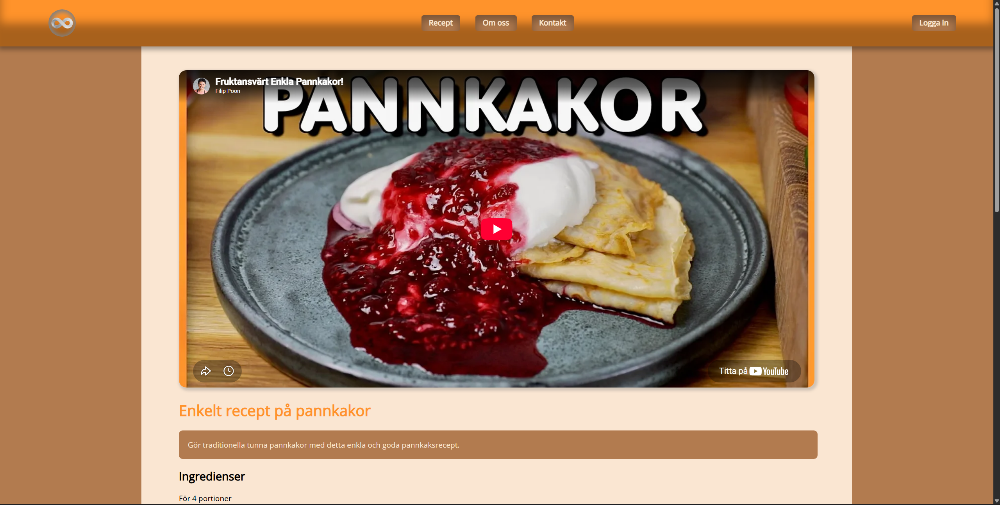
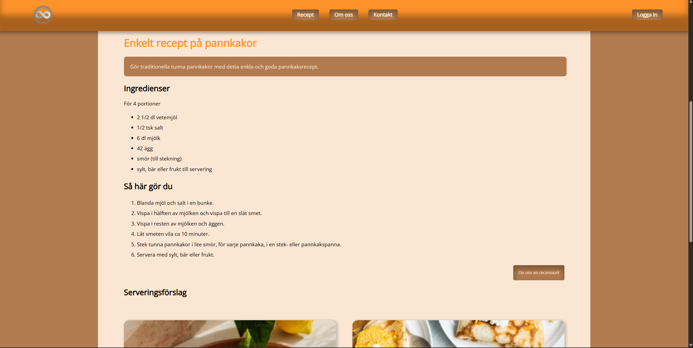
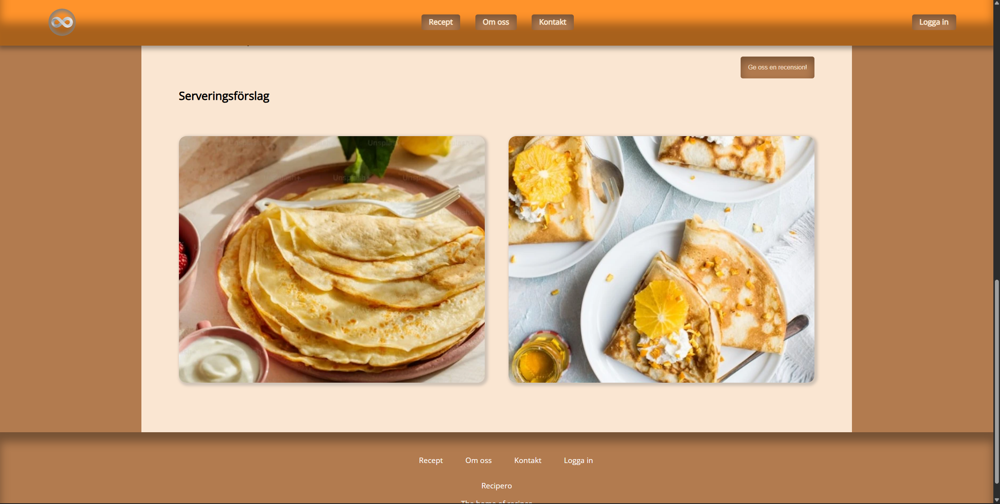
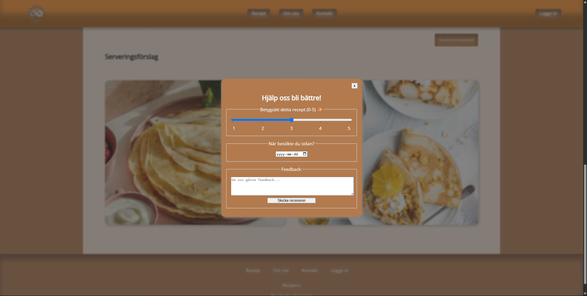
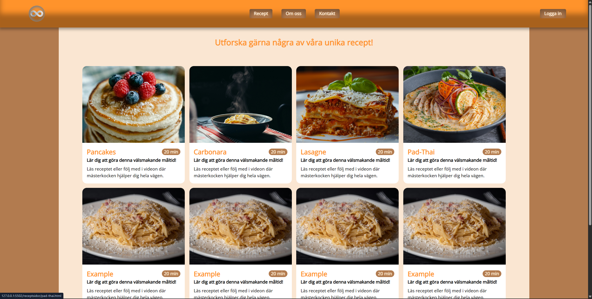

# 🥞 PannkaksRecept


PannkaksRecept is a Swedish recipe website created as my second portfolio project. It explores responsive layouts, reusable page styling, embedded cooking videos, and a simple recipe-review flow using plain HTML, CSS, and JavaScript.

---

## 🚧 Status

Completed as a portfolio learning project. The implemented recipe and feedback experiences are available, while some navigation items, example cards, and account-related elements remain non-functional placeholders. The project does not include a backend or authentication system.

---

## ✨ Features

- Responsive recipe gallery with layouts for desktop, tablet, and mobile screens
- Individual pages for pancakes, carbonara, lasagne, and pad thai
- Ingredients, cooking instructions, and serving suggestions
- Embedded YouTube recipe videos
- Responsive navigation with a mobile menu
- Recipe rating and feedback forms submitted through Formspree

---

## 📸 Preview

### Recipe video



### Recipe details



### Serving suggestions



### Review dialog



### Recipe gallery



---

## 🛠️ Tech Stack

- **HTML5** for semantic page structure and form controls
- **CSS3** for responsive layouts, styling, and reusable design variables
- **JavaScript** for mobile-navigation interactions
- **Formspree** for feedback form submissions

No framework, package manager, or build step is required.

---

## 🚀 Run Locally

Clone the repository:

```bash
git clone https://github.com/Zanny7/PannkaksRecept.git
cd PannkaksRecept
```

Open `index.html` directly in a browser, or serve the directory with a static development server such as the VS Code Live Server extension. The included workspace configuration uses port `5502`.

---

## 🙏 Credits

- Embedded recipe videos are created by [Filip Poon](https://www.youtube.com/c/FilipPoon) and displayed through YouTube embeds.
- [Open Sans](https://github.com/googlefonts/opensans) is distributed under the SIL Open Font License 1.1, included in the `fonts` directory.
- Feedback form handling is provided by [Formspree](https://formspree.io/).
- Food photography and the site logo are used as visual demonstration assets. Their original attribution details were not preserved in this project, and all rights remain with their respective creators.
